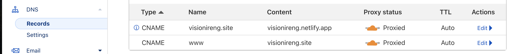

# Week 4 Assignment

## Register on Netlify Website

1. Go to Netlify.com website
2. Click sign up if you don’t have an account or you could sign in with your GitHub, GitLab or Bitbucket. For this one I Log In with GitHub.
3. After step 2 is done, the web will lead you to Team overview page.
4. Click Add New Site and it will appear 3 option such as; Import an existing project, Start from a template and Deploy Manually. For this one I click Import an existing project from my own GitHub repository.
5. On Connect to Git provider, click GitHub.
   )
7. Pick a repository from your GitHub, choose Branch to deploy based on your GitHub branch and click Deploy Site
8. Wait until the deploying proccess finish and you had your own website.

## Buy .site domain at NiagaHoster, connect to Netlify and Domain with Cloudflare
1. Go to niagahoster.co.id website
2. Click Login, you can choose to sign in with Google, Facebook or make your own account. For this one I choose to Sign In with Google.
3. Insert your favorite domain on the box and click Cek Sekarang.
   
5. If the domain available the next step is click pilih, duration for a year and cost Rp. 15,000.
6. Click Lanjutkan and choose payment method.
7. After the payment success, niagahoster.co.id will send you an email for receipt and activation link. 
8. Go to your Email and click activation link.
9. Your domain is activated.

## On Cloudflare:
1. Go to cloudflare.com and click Sign Up if you don’t have an account or you could login with Apple account. At this step I already have an account and I move forward to login.
2. On the Home page, click Add a Site.
3. Insert domain purchased earlier from niagahoster.co.id and click Add.
4. The site will direct to plan page, on below click Free plan and click continue. The site will do a quick scan, Scanning for Existing DNS records.
   
5. After scanning, the site require its user to Review DNS Records and click continue.
6. On Change your Nameserve, copy 2 links from Cloudflare’s nameservers for further use on niagahoster.co.id
   
7. Go to domain provider (in this case I’m using Niagahoster) and change the Nameserver with those 2 links
   ![Cloudflare}(Images/Readme Documentation/Cloudflare #7.png)

## Setting DNS:
1. Go to cloudflare account and click active website.
2. on the left side, choose DNS > Records > Click Add Record.
3. Enter “Type: CNAME, Name: @, IPv4 address: netlify link (ex: website.netlify.app)”
4. Enter “Type: CNAME, Name: www, IPv4 address: active Domain (ex: domain.site)”
   

## Connecting Domain in Netlify:
1. Sign in to Netlify Account and choose deployed website.
2. Click Domain Setting
3. Click Add domain alias
4. Type your domain name, click Add Domain
5. Everything is done and website is ready to be used.
   

This projec is far from perfect and I need your feedback to improve this prohject
